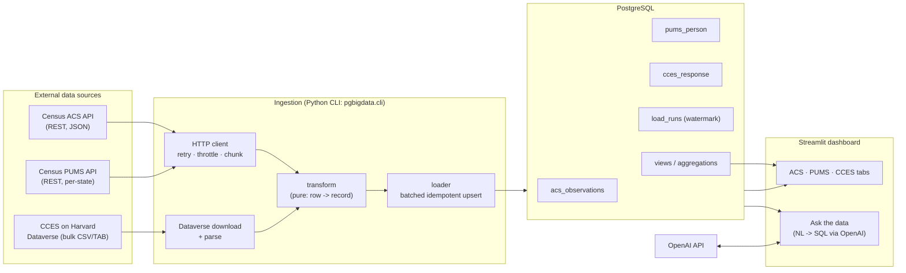
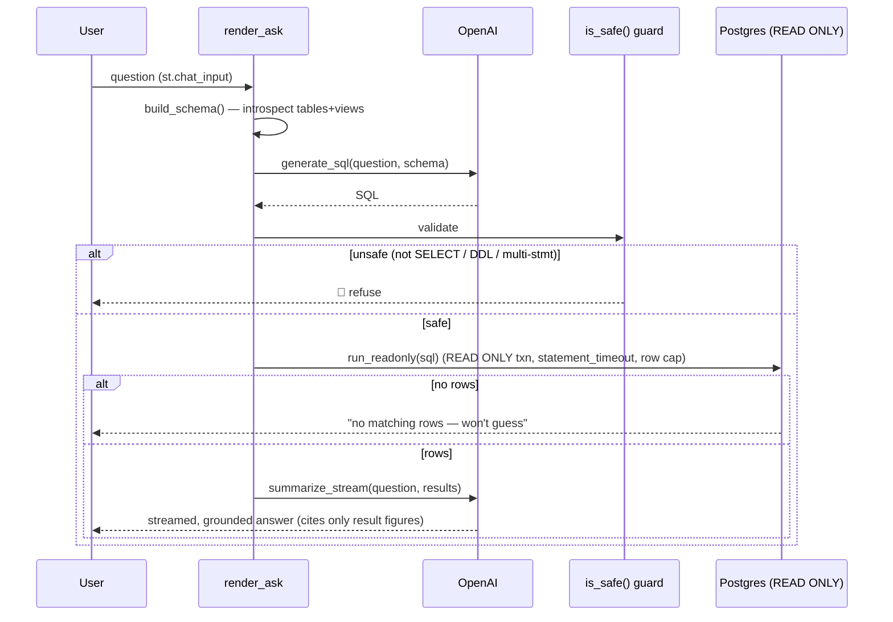
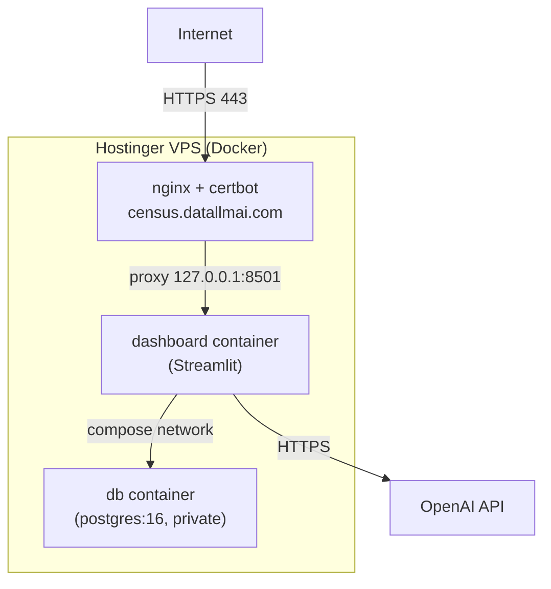

# PgBigData — Architecture & End-to-End Guide

A reference for understanding the whole system: the architecture, the database
(tables, indexes, views, aggregations), the ingestion pipelines, the dashboard,
the natural-language query layer, and how a request flows end to end.

> TL;DR — Python CLIs ingest three U.S. public datasets (Census **ACS**, Census
> **PUMS**, **CCES** survey) into **PostgreSQL** using one storage model
> (**typed columns for what you query + JSONB for everything else**). A
> **Streamlit** app reads the same database for point-and-click analytics and an
> **OpenAI-powered "Ask the data"** assistant that turns English into read-only
> SQL. Everything runs in Docker behind nginx/HTTPS on a VPS.

---

## 1. High-level architecture



**Two ingestion modes, one storage model, two read paths.**
- *Ingestion modes*: REST API at scale (ACS, PUMS) and bulk-file download (CCES).
- *Storage model*: typed/indexed columns for the fields you filter/join/weight,
  plus a complete `raw` **JSONB** copy of every source record.
- *Read paths*: the Streamlit tabs (SQL pushed down to Postgres) and the
  natural-language assistant (OpenAI writes the SQL, validated + run read-only).

---

## 2. Repository layout

```
src/pgbigdata/
  config.py            env-driven Config
  db.py                psycopg connection helper + SQL file runner
  cli.py               entrypoint: init-db | ingest-acs | ingest-pums | ingest-cces | status
  census/              ACS + PUMS share this REST client
    client.py          CensusClient: retry, throttle, geography chunking
    geography.py       geography levels + GEOID construction
    variables.py       ACS promotion map (typed vs JSONB) + value coercion
    transform.py       pure ACS row -> AcsRecord
    loader.py          batched idempotent upsert + run tracking (shared helpers)
  pums/                person-level microdata
    variables.py       PUMS promotion map, state FIPS list
    client.py          fetch_pums: chunk by state
    transform.py       pure PUMS row -> PumsRecord
    loader.py          upsert into pums_person
  cces/                bulk survey files
    variables.py       promotion map w/ per-year column aliases + Dataverse file ids
    download.py        cached Dataverse download + CSV/TAB auto-detect parse
    transform.py       pure CCES row -> CcesRecord
    loader.py          upsert into cces_response
sql/
  001_schema.sql       acs_observations + indexes; load_runs
  002_views.sql        v_acs_latest, v_acs_county_housing
  003_pums.sql         pums_person + indexes; v_pums_income_by_puma
  004_cces.sql         cces_response + indexes; v_cces_acs_county (crosswalk)
dashboard/
  app.py               Streamlit UI: ACS/PUMS/CCES tabs + Ask router
  nl_sql.py            NL -> SQL (OpenAI), schema introspection, SQL safety guard
deploy/
  deploy.sh            idempotent VPS deploy
  nginx-census.datallmai.com.conf
Dockerfile             app image (package + dashboard)
docker-compose.prod.yml  db (private) + dashboard (localhost:8501)
tests/                 pure-transform unit tests (no DB/network)
```

---

## 3. The storage model — the central decision

Every incoming field gets one of two homes, decided by **how it will be used**:

| Put it in… | When | Example |
| --- | --- | --- |
| **Typed column** (indexed) | you filter, sort, join, aggregate, or expose it | `median_household_income`, `pwgtp`, `countyfips` |
| **`raw` JSONB** | bulk payload you keep but query rarely / not yet | the other ~500 CCES survey items, ACS's long tail |

Both happen at once: **`raw` always holds the complete source record**, and a
curated subset is *promoted* to typed columns. Consequences:

- **Nothing is lost** — a field ignored today is still in `raw` tomorrow.
- **Promotion is a cheap, additive migration** — no re-ingest needed:
  ```sql
  ALTER TABLE cces_response ADD COLUMN cc18_308a text;
  UPDATE cces_response SET cc18_308a = raw->>'CC18_308a';  -- straight from JSONB
  CREATE INDEX ON cces_response (cc18_308a);
  ```
- The promotion list lives in one place per source: `*/variables.py`.

See [DESIGN.md](DESIGN.md) for the full rationale and indexing trade-offs.

---

## 4. Database schema

### 4.1 `acs_observations` — ACS aggregate (county + tract)
One row = one geography for one dataset vintage. Source: [sql/001_schema.sql](../sql/001_schema.sql).

| Column | Type | Notes |
| --- | --- | --- |
| `dataset, year, geography, geoid` | text/int | **PK** (natural key) |
| `name` | text | Census label |
| `total_population, median_household_income, median_home_value, median_gross_rent, unemployed_count, bachelors_count` | int/bigint | promoted typed columns |
| `raw` | jsonb | full API row |
| `created_at, updated_at` | timestamptz | |

Indexes: `(geography, year)` btree; partial btree on `median_household_income`
and `total_population`; **GIN `jsonb_path_ops`** on `raw` for containment
queries (`raw @> '{"state":"06"}'`).

### 4.2 `pums_person` — PUMS microdata
One row = one weighted person. Source: [sql/003_pums.sql](../sql/003_pums.sql).

- **PK** `(dataset, year, serialno, sporder)` — household serial + person number.
- Promoted: `st, puma`, `pwgtp` (weight), `agep, sex, rac1p, hisp, schl, esr,
  cow, wkhp, jwmnp, occp, indp, pincp, wagp, hicov`; plus `raw` JSONB.
- Indexes: `(year, st, puma)`; partial on `pincp`; GIN on `raw`.

### 4.3 `cces_response` — CCES survey
One row = one survey respondent. Source: [sql/004_cces.sql](../sql/004_cces.sql).

- **PK** `(year, caseid)`.
- Promoted: weights (`commonweight, commonpostweight, vvweight`), crosswalk keys
  (`inputstate, countyfips, cd`), demographics (`birthyr, gender, educ, race,
  hispanic, marstat`), politics (`votereg, pid3, pid7, ideo5`); plus `raw` JSONB
  holding all ~500 survey items.
- Indexes: `(year, inputstate)`, partial on `countyfips`, `(year, pid3)`.

### 4.4 `load_runs` — the watermark / audit log
Every ingestion run inserts a row here (`running` → `success`/`failed`) with the
parameters, row count, and any error. Two jobs:
1. **Idempotency/incremental**: `already_loaded()` checks for a prior `success`
   on `(dataset, year, geography)` and skips unless `--force`.
2. **Observability**: `pgbigdata.cli status` reads the last runs.

---

## 5. Views & aggregations

Views are the **stable, consumer-facing contract** (the dashboard and CMS read
these, not base tables). Defined in [sql/002_views.sql](../sql/002_views.sql) and
[sql/004_cces.sql](../sql/004_cces.sql).

| View | What it computes |
| --- | --- |
| `v_acs_latest` | Latest vintage per `(geography, geoid)` via `DISTINCT ON (... ) ORDER BY year DESC` — clean typed projection. |
| `v_acs_county_housing` | Demonstrates reading an **un-promoted** field straight from JSONB: `(raw->>'B25001_001E')::bigint`. |
| `v_pums_income_by_puma` | **Weighted aggregation**: `sum(pwgtp)` = weighted population; `sum(pincp*pwgtp)/sum(pwgtp)` = weighted mean income, grouped by `(year, st, puma)`. |
| `v_cces_acs_county` | **The crosswalk**: joins each CCES respondent to their ACS county — `a.year = c.year AND a.geoid = lpad(c.countyfips,5,'0')`. Exposes `county_median_income`, `county_population` next to survey fields. |

### Weighting (why it matters)
PUMS and CCES are *samples*; every population estimate must be weighted:
- **PUMS**: weight by `pwgtp` (e.g. ~19.5k sampled people → ~1.9M population).
- **CCES**: weight by `commonweight`.
- **Weighted mean** of metric *m*: `sum(m * w) / sum(w)` (with `FILTER (WHERE m
  IS NOT NULL)` so nulls don't distort the denominator). The dashboard's PUMS
  and CCES tabs push exactly these expressions to Postgres.

---

## 6. Ingestion pipelines — end to end

All three follow the same shape: **fetch → transform (pure) → load (idempotent
upsert) → record run**. They share the run-tracking + batching helpers in
[census/loader.py](../src/pgbigdata/census/loader.py).

### 6.1 ACS (REST API)
`pgbigdata.cli ingest-acs --year 2024 --geography county`

1. `cmd_ingest_acs` ([cli.py](../src/pgbigdata/cli.py)) checks `already_loaded()`.
2. `CensusClient.fetch()` ([census/client.py](../src/pgbigdata/census/client.py)):
   - builds the request from `geography.py` (`for=`/`in=` params) and
     `variables.get_param()` (the `get=` variable list);
   - **chunks** fine geographies by parent — tracts fan out to one request per
     state (the API has no cursor pagination);
   - `_get()` applies a **min-interval throttle**, **retries with exponential
     backoff + jitter** on 429/5xx/network, and fails fast on 4xx / non-JSON
     ("Missing Key") pages.
3. `transform_row()` builds the GEOID, coerces numerics (Census "jam" sentinels
   like `-666666666` → NULL), splits into promoted columns + `raw`.
4. `loader.load()` upserts in 500-row batches (`ON CONFLICT ... DO UPDATE`),
   commits per batch, and writes the `load_runs` row.

### 6.2 PUMS (REST API, per-state)
`pgbigdata.cli ingest-pums --year 2024 [--states 06,48 | --all-states]`

Same client/loader machinery; `fetch_pums()`
([pums/client.py](../src/pgbigdata/pums/client.py)) iterates state FIPS issuing
`for=state:NN`. Natural key `(serialno, sporder)`. Negative incomes are **kept**
(a loss is valid), unlike the ACS jam-sentinel handling.

### 6.3 CCES (bulk file from Dataverse)
`pgbigdata.cli ingest-cces --year 2024`

1. `download()` ([cces/download.py](../src/pgbigdata/cces/download.py)) resolves
   the Dataverse datafile id (per-year map in `variables.DATAVERSE_FILE_IDS`),
   follows the 303→S3 redirect, and **caches** the file (so re-runs don't
   re-pull 100+ MB).
2. `iter_rows()` **auto-detects the delimiter** — 2018 ships `.tab`, 2022/2024
   ship `.csv`.
3. `transform_row()` reads the first present **column alias** (`gender`/`gender4`,
   `cdid116`/`cdid118`/`cdid119`) so one schema spans survey years; ~500 items
   land in `raw`.
4. `loader.load()` upserts into `cces_response` on `(year, caseid)`.

### Idempotency in one picture
```
ingest ──> already_loaded(dataset,year,geo)? ──yes(no --force)──> skip
                       │ no
                       ▼
        _start_run(status=running) ─► upsert batches (ON CONFLICT DO UPDATE)
                       │                         │ (commit per batch)
                       ▼                         ▼
              _finish_run(success)        on error: _finish_run(failed)
```

---

## 7. The dashboard

[dashboard/app.py](../dashboard/app.py) — one Streamlit app, a sidebar **Dataset**
switch routes to four renderers:

- **ACS aggregate** — loads a geography into pandas (cached), with a **Year**
  selector; tabs: sortable table, top-N rankings, distribution histogram,
  income-vs-home-value scatter, by-state pivot.
- **PUMS microdata** — **weighted aggregations done in SQL** (`render_pums`):
  income by PUMA, age bands, education×employment cross-tab, per-PUMA pivot,
  sample rows. Year + state filters via `_where()`.
- **CCES survey** — weighted party-ID / ideology / education, **Party × county
  income** (uses `v_cces_acs_county`), sample rows.
- **💬 Ask the data** — see §8.

Design choice: PUMS/CCES aggregations are **pushed down to Postgres** (CASE-based
bucketing, `sum(w)`), not computed by pulling millions of rows into the browser —
so it scales to a national pull.

---

## 8. "Ask the data" — natural language → SQL

[dashboard/nl_sql.py](../dashboard/nl_sql.py) + `render_ask()` in app.py. Flow:



**Grounding & safety (defence in depth):**
1. **Schema-aware prompt** — `build_schema()` introspects the live tables *and*
   views, so the model uses real column names.
2. **`is_safe()`** — rejects anything that isn't a single `SELECT`/`WITH`
   (regex blocks `insert/update/delete/drop/alter/create/grant/...`, multi-stmt).
3. **`run_readonly()`** — runs inside a `SET TRANSACTION READ ONLY` with
   `statement_timeout` and a fetch cap, then rolls back. A bad query can't write
   or hang.
4. **Grounded summary** — `summarize_stream()` is instructed to use *only* the
   returned rows, cite exact figures, and reply "No matching data" when empty;
   the UI streams it token-by-token and labels it "derived only from the results".

Chat history is stored in `st.session_state` and re-rendered from saved content,
so reruns never re-call OpenAI or re-query.

---

## 9. End-to-end code flow (three concrete traces)

**A. `init-db`** → `cli.cmd_init_db` → `db.connect()` → `db.run_sql_file()` for
each of `sql/001…004` → tables, indexes, views exist.

**B. A PUMS ingest** →
`cli.cmd_ingest_pums` → `already_loaded?` → `CensusClient.fetch_pums()` (per-state
throttled/retried GETs) → generator of dict rows → `pums.transform.transform_row`
→ `pums.loader.load()` (batched `ON CONFLICT` upsert, `load_runs` updated) →
`pums_person` populated.

**C. A dashboard "Ask" question** →
`render_ask` → `nl_sql.build_schema(run_df)` → `nl_sql.generate_sql` (OpenAI) →
`nl_sql.is_safe` → `app.run_readonly` (read-only txn) → `st.dataframe` +
`nl_sql.summarize_stream` (OpenAI, streamed) → grounded answer.

---

## 10. Deployment



- **[Dockerfile](../Dockerfile)** builds one image (package + dashboard); the
  CLI runs as one-off `docker compose run --rm dashboard python -m pgbigdata.cli …`.
- **[docker-compose.prod.yml](../docker-compose.prod.yml)** — `db` has **no public
  port** (compose-network only); `dashboard` binds **`127.0.0.1:8501`** so only
  nginx reaches it.
- **nginx + certbot** terminate TLS for `census.datallmai.com` (WebSocket
  upgrade headers required for Streamlit). Config:
  [deploy/nginx-census.datallmai.com.conf](../deploy/nginx-census.datallmai.com.conf).
- **Redeploy**: `rsync` the tree to the VPS then `bash deploy/deploy.sh`
  (build → ingest → nginx → certbot, idempotent).

---

## 11. Configuration (env vars)

| Var | Used by | Purpose |
| --- | --- | --- |
| `DATABASE_URL` | everything | Postgres DSN (compose: `…@db:5432/…`) |
| `CENSUS_API_KEY` | ACS/PUMS ingest | required by the Census API |
| `OPENAI_API_KEY`, `OPENAI_MODEL` | Ask tab | NL→SQL (default `gpt-4o-mini`) |
| `POSTGRES_USER/PASSWORD/DB` | compose | DB bootstrap |
| `REQUEST_TIMEOUT_S`, `MAX_RETRIES`, `BACKOFF_BASE_S`, `MIN_REQUEST_INTERVAL_S` | client | HTTP tuning |
| `CCES_CACHE_DIR` | CCES | download cache location |

Secrets live only in `/root/pgbigdata/.env` on the VPS (git-ignored).

---

## 12. Data currently loaded

| Dataset | Years | Rows (approx) |
| --- | --- | --- |
| ACS county | 2022, 2023, 2024 | 3,222 each |
| ACS tract | 2022, 2023, 2024 | ~85,400 each |
| PUMS person (3 states) | 2022, 2023, 2024 | ~19,500–19,700 each |
| CCES respondents | 2022, 2024 | 60,000 each |

ACS & PUMS share the same years as CCES (CCES has no 2023 edition), so
`v_cces_acs_county` joins survey year → matching ACS vintage.

---

## 13. Extending the system

- **Promote a new field**: add it to the relevant `variables.py` `PROMOTED`
  list + a column in the `sql/*.sql` DDL, then backfill from `raw` (no re-ingest).
- **New ACS variable in JSONB only**: add its code to `EXTRA_FETCH` (ACS) — it
  lands in `raw`, reachable via `raw->>'CODE'`.
- **New geography**: add an entry to `census/geography.py::GEOGRAPHIES`.
- **New CCES year**: add the Dataverse file id to `DATAVERSE_FILE_IDS` (and a
  column alias if the year renamed something).
- **New source entirely** (e.g. voter files): add a `src/pgbigdata/<source>/`
  package mirroring `cces/` (download/transform/loader) + a `sql/00N_*.sql`,
  reusing the shared run-tracking helpers.

---

*Generated as living documentation; keep it in sync when schema or flow changes.*
